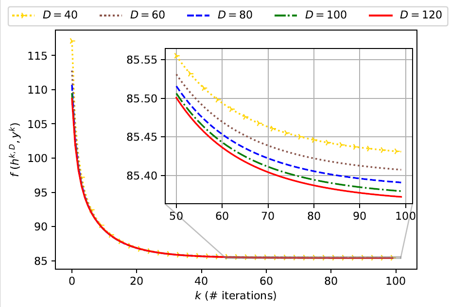

# Algorithm-for-Bilevel-Opt-with-Traffic-Eqbm
* **Paper**: Goyal, A., & Lamperski, A. (2023). An algorithm for bilevel optimization with traffic equilibrium constraints: convergence rate analysis. arXiv preprint arXiv:2306.14235.

