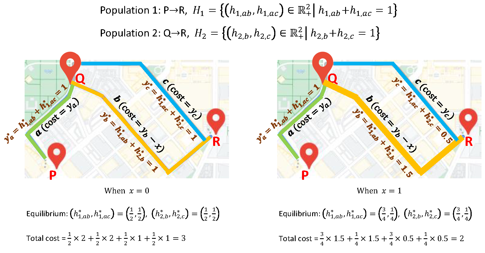

# Algorithm-for-Bilevel-Opt-with-Traffic-Eqbm
* **Toy Example**  
  
  
* **Paper**: Goyal, A., & Lamperski, A. (2023). An algorithm for bilevel optimization with traffic equilibrium constraints: convergence rate analysis. arXiv preprint arXiv:2306.14235. [https://arxiv.org/abs/2306.14235](https://arxiv.org/abs/2306.14235)
     
    * Results on transport network design problem for **Sioux Falls Network**
      
      
    

